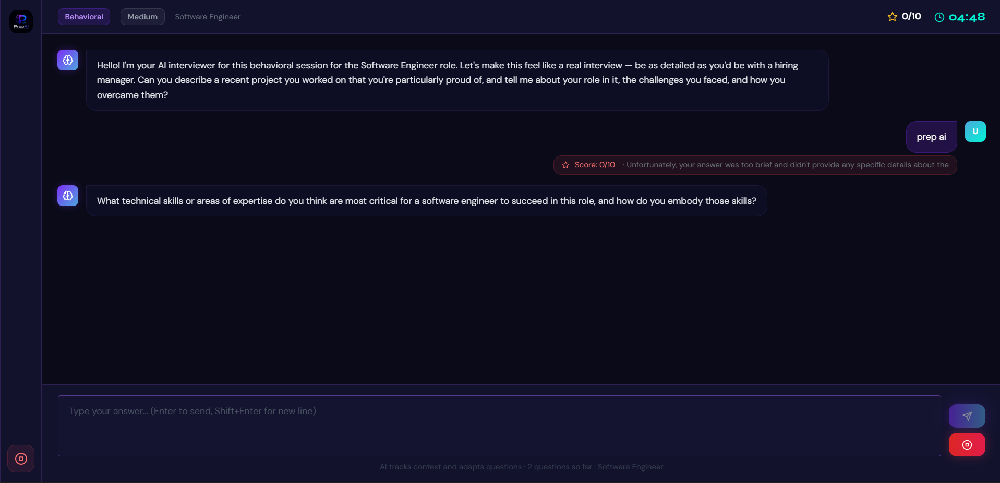
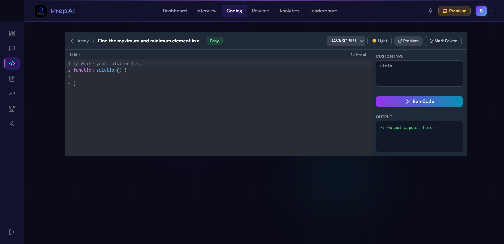
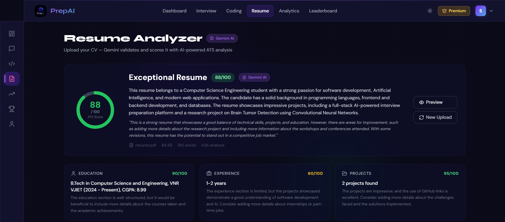
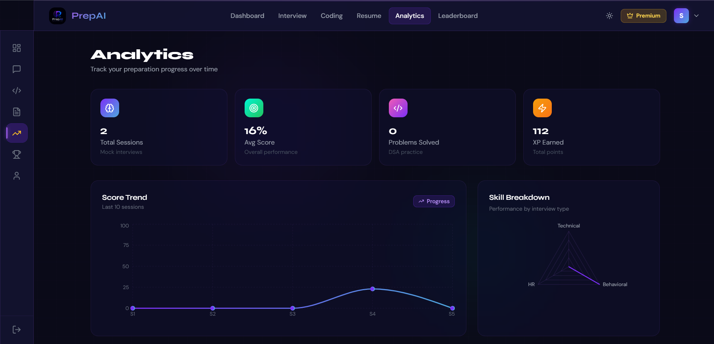
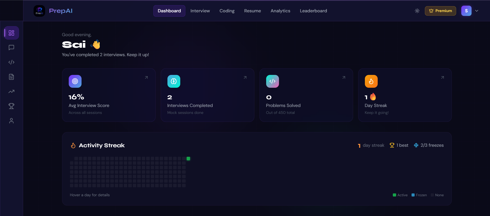

# 🚀 PrepAI

### AI-Powered Interview Preparation Platform

**Practice DSA. Analyze your resume. Take adaptive AI interviews. Prepare smarter.**

[🌐 Live Demo](https://project-2-virid-alpha.vercel.app/) · [💻 GitHub](https://github.com/Shiva291-045/project-2.git)

---

## ✨ Features

- 🤖 **Adaptive AI Interviews** — Context-aware questions and intelligent follow-ups
- 🧠 **450+ DSA Problems** — Coding practice with editor and test cases
- 📄 **AI Resume Analyzer** — Gemini-powered ATS scoring and skill analysis
- 📊 **Analytics** — Track performance, progress and skill gaps
- 🏆 **Leaderboard & XP** — Achievements and preparation streaks
- 💳 **Premium Plans** — Razorpay payments
- 🔐 **Authentication** — Firebase + JWT
- 🌓 **Dark / Light Mode**

## 🤖 Adaptive AI Interviews

PrepAI is designed to **listen to the candidate's answer and decide what to ask next**, rather than simply asking random questions.

```text
Question → Your Answer → AI Analysis → Contextual Follow-up
```



## 🧠 DSA Practice

Practice 450+ structured DSA problems with a coding editor, test cases and progress tracking.



## 📄 AI Resume Analyzer

Upload a resume and get a Gemini-powered ATS score, resume analysis, skills and improvement suggestions.



## 📊 Analytics

Track interview performance, DSA progress, XP and skill breakdown over time.



## 🏠 Dashboard

A single place to see preparation progress, interviews, solved problems and streaks.



---

## 🛠️ Tech Stack

| Layer | Technologies |
|---|---|
| Frontend | React 18, Tailwind CSS, Framer Motion |
| Backend | Node.js, Express |
| Database | MongoDB |
| AI | **Google Gemini** |
| Authentication | Firebase + JWT |
| Payments | Razorpay |
| Deployment | Vercel + Render |

---

## 🚀 Quick Start

### Backend

```bash
cd server
npm install
npm run dev
```

Create `.env`:

```env
MONGODB_URI=your_mongodb_uri
JWT_SECRET=your_jwt_secret
GEMINI_API_KEY=your_gemini_api_key
FRONTEND_URL=http://localhost:3000
```

### Frontend

```bash
npm install
npm start
```

Configure Firebase and the backend API URL in your frontend environment variables.

> Never commit API keys, database passwords or JWT secrets.

---

## 🗺️ Roadmap

- [ ] Personalized placement-readiness score
- [ ] Smarter DSA recommendations
- [ ] Resume → skill-gap → preparation flow
- [ ] Advanced interview reports
- [ ] Preparation calendar and streaks
- [ ] Company-specific preparation

---

## 👨‍💻 Developer

**Shiva**

> Practice. Prepare. Perform.
