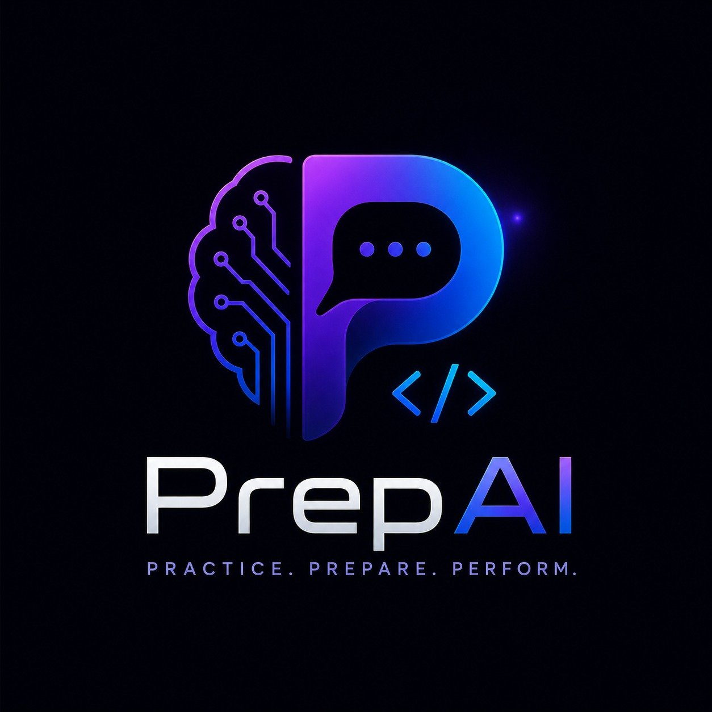

<div align="center">
  
  
  # PrepAI — AI Interview Preparation Platform
  
  **Developed by Shiva** · Practice. Prepare. Perform.
  
  [](https://vercel.com)
  [](https://render.com)
  [](https://mongodb.com)
  [](https://aistudio.google.com)
</div>

---

## 🚀 Features

- **AI Mock Interviews** — 20 roles, context-aware, no repeated questions, intelligent follow-ups
- **AI Resume Analyzer** — Gemini validates and scores your resume with ATS analysis
- **450 DSA Problems** — CodeMirror editor, test cases, AI hints
- **Deep Analytics** — Performance trends, skill gap analysis
- **Leaderboard** — Global ranking, XP system, achievements
- **Razorpay Payments** — Premium plans with UPI, Cards, Net Banking
- **JWT Auth** — Secure authentication with email verification
- **Light/Dark Mode** — Toggle in header

## 🏗️ Tech Stack

| Layer | Tech |
|-------|------|
| Frontend | React 18, Tailwind CSS, Framer Motion |
| Backend | Node.js, Express, MongoDB |
| AI | Google Gemini 1.5 Flash |
| Auth | Firebase + JWT |
| Payments | Razorpay |
| Deploy | Vercel (FE) + Render (BE) |

## 🔧 Local Setup

### Backend
```bash
cd server
cp .env.example .env
# Fill in MONGODB_URI, GEMINI_API_KEY, JWT_SECRET
npm install
npm run dev
```

### Frontend
```bash
# In root
cp .env.local.example .env.local
# Fill in Firebase config + REACT_APP_API_URL
npm install
npm start
```

## 🌐 Deployment

### Backend (Render) — required environment variables:
```
NODE_ENV=production
MONGODB_URI=mongodb+srv://...
JWT_SECRET=your_secure_secret_min_32_chars
GEMINI_API_KEY=your_gemini_api_key
FRONTEND_URL=https://your-app.vercel.app
RAZORPAY_KEY_ID=rzp_live_...
RAZORPAY_KEY_SECRET=...
```

### Frontend (Vercel) — required environment variables:
```
REACT_APP_API_URL=https://your-render-app.onrender.com
REACT_APP_FIREBASE_API_KEY=...
REACT_APP_FIREBASE_AUTH_DOMAIN=...
REACT_APP_FIREBASE_PROJECT_ID=...
REACT_APP_FIREBASE_STORAGE_BUCKET=...
REACT_APP_FIREBASE_MESSAGING_SENDER_ID=...
REACT_APP_FIREBASE_APP_ID=...
REACT_APP_RAZORPAY_KEY_ID=rzp_live_...
```

## 📁 Interview Roles (20)

AI Engineer, Cloud Engineer, DevOps Engineer, Full Stack Developer, Frontend Developer,
Backend Developer, Data Scientist, Machine Learning Engineer, Cybersecurity Analyst,
Software Engineer, UI/UX Designer, Mobile App Developer, Blockchain Developer,
Product Manager, QA Engineer, System Design Engineer, Site Reliability Engineer,
Data Engineer, Solutions Architect, Engineering Manager

---

<div align="center">
  Developed by <strong>Shiva</strong> · PrepAI © 2025
</div>
